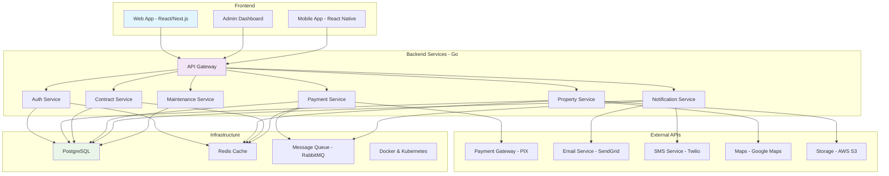

## 🏗️ **ARQUITETURA DO SISTEMA**

```mermaid
graph TB
    subgraph Frontend
        A[Web App - React/Next.js]
        B[Admin Dashboard]
        C[Mobile App - React Native]
    end
    
    subgraph Backend Services - Go
        D[API Gateway]
        E[Auth Service]
        F[Property Service]
        G[Contract Service]
        H[Payment Service]
        I[Notification Service]
        J[Maintenance Service]
    end
    
    subgraph External APIs
        K[Payment Gateway - PIX]
        L[Email Service - SendGrid]
        L2[SMS Service - Twilio]
        M[Maps - Google Maps]
        N[Storage - AWS S3]
    end
    
    subgraph Infrastructure
        O[PostgreSQL]
        P[Redis Cache]
        Q[Message Queue - RabbitMQ]
        R[Docker & Kubernetes]
    end
    
    A --> D
    B --> D
    C --> D
    D --> E
    D --> F
    D --> G
    D --> H
    D --> I
    D --> J
    
    H --> K
    I --> L
    I --> L2
    F --> M
    F --> N
    
    E & F & G & H & I & J --> O
    E & F & G & H --> P
    H & I --> Q
    
    style A fill:#e1f5fe
    style D fill:#f3e5f5
    style O fill:#e8f5e8
```