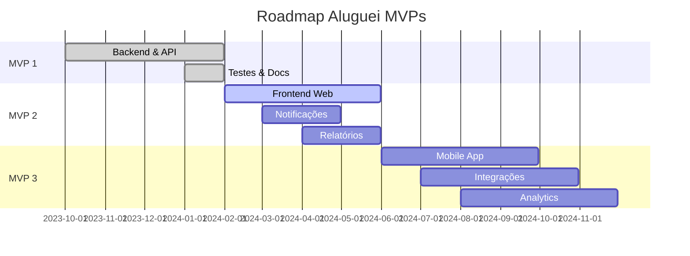

# 🚀 MVPs do Projeto Aluguei

## Estratégia de Desenvolvimento

O projeto Aluguei segue uma abordagem incremental com 3 MVPs principais, cada um agregando valor e validando hipóteses de mercado.

## MVP 1 - Backend & API Core ✅

**Status**: Implementado  
**Período**: Q4 2023 - Q1 2024  
**Objetivo**: Validar arquitetura e funcionalidades básicas

### Funcionalidades Implementadas

#### Autenticação & Segurança
- ✅ Sistema de login com JWT
- ✅ Hash de senhas com bcrypt
- ✅ Middleware de autenticação
- ✅ Validação de dados de entrada

#### Gestão de Proprietários
- ✅ CRUD completo (Create, Read, Update, Delete)
- ✅ Busca por email
- ✅ Validação de CPF
- ✅ Relacionamento com propriedades

#### Gestão de Propriedades
- ✅ Cadastro com informações completas
- ✅ Status (disponível, alugado, manutenção)
- ✅ Filtros por status e proprietário
- ✅ Cálculo automático de área e valores

#### Gestão de Inquilinos
- ✅ Cadastro vinculado ao proprietário
- ✅ Validação de documentos
- ✅ Histórico de contratos
- ✅ Busca e filtros

#### Contratos Digitais
- ✅ Criação e gestão de contratos
- ✅ Status (ativo, expirado, cancelado)
- ✅ Vinculação propriedade-inquilino
- ✅ Controle de datas e valores

#### Gestão de Pagamentos
- ✅ Registro de pagamentos
- ✅ Status (pendente, pago, atrasado)
- ✅ Histórico por contrato
- ✅ Relatórios de inadimplência

#### Infraestrutura
- ✅ API REST completa (30+ endpoints)
- ✅ Documentação Swagger
- ✅ Banco PostgreSQL com GORM
- ✅ Docker para desenvolvimento
- ✅ Sistema de seeds com dados de teste
- ✅ Testes abrangentes (55+ testes)

### Arquitetura Técnica
- **Clean Architecture** com DDD
- **Camadas**: Domain, Application, Infrastructure, Presentation
- **Padrões**: Repository, Use Cases, Dependency Injection
- **Qualidade**: 90%+ cobertura de testes

### Métricas MVP 1
- **Endpoints**: 30+ implementados
- **Testes**: 55+ (unit, integration, benchmark)
- **Performance**: < 100ms response time
- **Documentação**: 100% dos endpoints documentados

---

## MVP 2 - Interface Web & UX 🔄

**Status**: Planejado  
**Período**: Q2 2024  
**Objetivo**: Validar usabilidade e experiência do usuário

### Funcionalidades Planejadas

#### Frontend Web
- 🔄 Interface React/TypeScript responsiva
- 🔄 Dashboard proprietário com métricas
- 🔄 Portal do inquilino
- 🔄 Formulários intuitivos para cadastros
- 🔄 Tabelas com filtros e paginação

#### Sistema de Notificações
- 🔄 Email para vencimentos
- 🔄 SMS para lembretes urgentes
- 🔄 Notificações in-app
- 🔄 Templates personalizáveis

#### Relatórios Financeiros
- 🔄 Dashboard com gráficos
- 🔄 Relatório de inadimplência
- 🔄 Extrato de pagamentos
- 🔄 Projeções de receita
- 🔄 Exportação PDF/Excel

#### Melhorias UX
- 🔄 Onboarding guiado
- 🔄 Tooltips e ajuda contextual
- 🔄 Validação em tempo real
- 🔄 Feedback visual de ações

### Stack Técnica MVP 2
- **Frontend**: React 18, TypeScript, Tailwind CSS
- **Estado**: Zustand ou Redux Toolkit
- **Formulários**: React Hook Form + Zod
- **Gráficos**: Chart.js ou Recharts
- **Notificações**: SendGrid + Twilio

### Métricas MVP 2
- **Performance**: Lighthouse > 90
- **Acessibilidade**: WCAG 2.1 AA
- **Mobile**: 100% responsivo
- **SEO**: Meta tags otimizadas

---

## MVP 3 - Mobile & Integrações 📋

**Status**: Futuro  
**Período**: Q3-Q4 2024  
**Objetivo**: Expansão de canais e integrações

### Funcionalidades Futuras

#### Aplicativo Mobile
- 📋 App React Native multiplataforma
- 📋 Push notifications
- 📋 Câmera para comprovantes
- 📋 Geolocalização de propriedades
- 📋 Modo offline básico

#### Integrações Financeiras
- 📋 PIX automático via API
- 📋 Boleto bancário
- 📋 Cartão de crédito
- 📋 Conciliação automática
- 📋 Open Banking

#### Funcionalidades Avançadas
- 📋 Assinatura digital de contratos
- 📋 Sistema de manutenção
- 📋 Chat em tempo real
- 📋 Avaliação de inquilinos
- 📋 Marketplace de serviços

#### Analytics & BI
- 📋 Dashboard executivo
- 📋 Análise preditiva de inadimplência
- 📋 Benchmarks de mercado
- 📋 Relatórios customizáveis
- 📋 API para integrações

### Integrações Planejadas
- **Bancos**: Itaú, Bradesco, Santander
- **Pagamentos**: PagSeguro, Mercado Pago
- **Documentos**: DocuSign, ClickSign
- **Comunicação**: WhatsApp Business API
- **Mapas**: Google Maps, OpenStreetMap

---

## Critérios de Sucesso por MVP

### MVP 1 ✅
- [x] API funcional com todos os endpoints
- [x] Testes automatizados > 80% cobertura
- [x] Documentação completa
- [x] Performance < 200ms
- [x] Deploy automatizado

### MVP 2 🔄
- [ ] Interface web completa e responsiva
- [ ] 50+ usuários beta testando
- [ ] NPS > 60 dos beta users
- [ ] 0 bugs críticos em produção
- [ ] Onboarding < 5 minutos

### MVP 3 📋
- [ ] App mobile nas lojas
- [ ] 500+ usuários ativos
- [ ] Integração PIX funcionando
- [ ] Receita recorrente > R$ 10k/mês
- [ ] Churn rate < 5%

## Roadmap de Releases

## Estratégia de Validação

### MVP 1 - Validação Técnica ✅
- Arquitetura escalável implementada
- Performance adequada validada
- Testes automatizados garantem qualidade
- Documentação permite integração

### MVP 2 - Validação de Produto 🔄
- Beta com 50 proprietários selecionados
- Métricas de usabilidade (tempo de task, erros)
- Feedback qualitativo via entrevistas
- A/B testing em funcionalidades críticas

### MVP 3 - Validação de Mercado 📋
- Lançamento público com freemium
- Métricas de negócio (CAC, LTV, Churn)
- Análise competitiva
- Pesquisa de satisfação NPS

Cada MVP constrói sobre o anterior, validando hipóteses incrementalmente e reduzindo riscos de desenvolvimento.