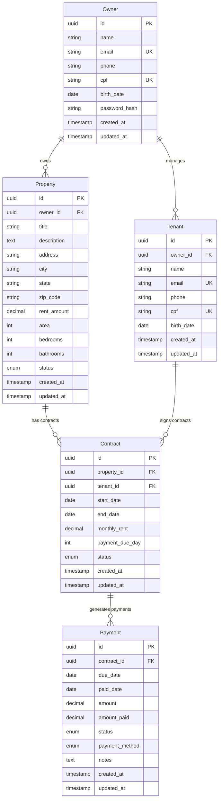

# 🏗️ Entidades do Sistema Aluguei

## Visão Geral

O sistema Aluguei é estruturado em 5 entidades principais que representam o domínio de gestão de aluguéis imobiliários, seguindo princípios de Domain-Driven Design (DDD).

## Diagrama de Relacionamentos



---

## 1. Owner (Proprietário)

### Descrição
Representa o proprietário de imóveis que utiliza o sistema para gerenciar suas propriedades e inquilinos.

### Atributos
| Campo | Tipo | Obrigatório | Descrição |
|-------|------|-------------|-----------|
| `id` | UUID | ✅ | Identificador único |
| `name` | String | ✅ | Nome completo |
| `email` | String | ✅ | Email único para login |
| `phone` | String | ✅ | Telefone de contato |
| `cpf` | String | ✅ | CPF único (validado) |
| `birth_date` | Date | ❌ | Data de nascimento |
| `password_hash` | String | ✅ | Senha criptografada |
| `created_at` | Timestamp | ✅ | Data de criação |
| `updated_at` | Timestamp | ✅ | Data de atualização |

### Regras de Negócio
- Email deve ser único no sistema
- CPF deve ser válido e único
- Senha deve ter no mínimo 6 caracteres
- Não pode ser deletado se possuir propriedades ativas
- Telefone deve seguir formato brasileiro

### Relacionamentos
- **1:N** com Property (um proprietário pode ter várias propriedades)
- **1:N** com Tenant (um proprietário pode gerenciar vários inquilinos)

### Métodos de Domínio
```go
func (o *Owner) ValidateForCreation() error
func (o *Owner) ValidateForUpdate() error
func (o *Owner) CanBeDeleted() bool
func (o *Owner) GetActivePropertiesCount() int
```

---

## 2. Property (Propriedade)

### Descrição
Representa um imóvel que pode ser alugado, contendo todas as informações necessárias para gestão.

### Atributos
| Campo | Tipo | Obrigatório | Descrição |
|-------|------|-------------|-----------|
| `id` | UUID | ✅ | Identificador único |
| `owner_id` | UUID | ✅ | Referência ao proprietário |
| `title` | String | ✅ | Título da propriedade |
| `description` | Text | ❌ | Descrição detalhada |
| `address` | String | ✅ | Endereço completo |
| `city` | String | ✅ | Cidade |
| `state` | String | ✅ | Estado (UF) |
| `zip_code` | String | ❌ | CEP |
| `rent_amount` | Decimal | ✅ | Valor do aluguel |
| `area` | Integer | ❌ | Área em m² |
| `bedrooms` | Integer | ❌ | Número de quartos |
| `bathrooms` | Integer | ❌ | Número de banheiros |
| `status` | Enum | ✅ | Status da propriedade |
| `created_at` | Timestamp | ✅ | Data de criação |
| `updated_at` | Timestamp | ✅ | Data de atualização |

### Status Possíveis
- `available` - Disponível para aluguel
- `rented` - Atualmente alugada
- `maintenance` - Em manutenção
- `inactive` - Inativa

### Regras de Negócio
- Deve pertencer a um proprietário válido
- Valor do aluguel deve ser positivo
- Status é atualizado automaticamente ao criar/cancelar contratos
- Não pode ser deletada se possuir contratos ativos
- CEP deve seguir formato brasileiro (se informado)

### Relacionamentos
- **N:1** com Owner (várias propriedades pertencem a um proprietário)
- **1:N** com Contract (uma propriedade pode ter vários contratos)

### Métodos de Domínio
```go
func (p *Property) ValidateForCreation() error
func (p *Property) ValidateForUpdate() error
func (p *Property) CanBeDeleted() bool
func (p *Property) UpdateStatus(status PropertyStatus) error
func (p *Property) GetActiveContract() *Contract
```

---

## 3. Tenant (Inquilino)

### Descrição
Representa um inquilino que pode alugar propriedades gerenciadas por um proprietário.

### Atributos
| Campo | Tipo | Obrigatório | Descrição |
|-------|------|-------------|-----------|
| `id` | UUID | ✅ | Identificador único |
| `owner_id` | UUID | ✅ | Proprietário que gerencia |
| `name` | String | ✅ | Nome completo |
| `email` | String | ✅ | Email único |
| `phone` | String | ✅ | Telefone de contato |
| `cpf` | String | ✅ | CPF único (validado) |
| `birth_date` | Date | ❌ | Data de nascimento |
| `created_at` | Timestamp | ✅ | Data de criação |
| `updated_at` | Timestamp | ✅ | Data de atualização |

### Regras de Negócio
- Email deve ser único no sistema
- CPF deve ser válido e único
- Deve estar vinculado a um proprietário
- Não pode ser deletado se possuir contratos ativos
- Telefone deve seguir formato brasileiro

### Relacionamentos
- **N:1** com Owner (vários inquilinos são gerenciados por um proprietário)
- **1:N** com Contract (um inquilino pode ter vários contratos)

### Métodos de Domínio
```go
func (t *Tenant) ValidateForCreation() error
func (t *Tenant) ValidateForUpdate() error
func (t *Tenant) CanBeDeleted() bool
func (t *Tenant) GetActiveContracts() []Contract
```

---

## 4. Contract (Contrato)

### Descrição
Representa um contrato de aluguel entre uma propriedade e um inquilino, definindo termos e condições.

### Atributos
| Campo | Tipo | Obrigatório | Descrição |
|-------|------|-------------|-----------|
| `id` | UUID | ✅ | Identificador único |
| `property_id` | UUID | ✅ | Propriedade alugada |
| `tenant_id` | UUID | ✅ | Inquilino contratante |
| `start_date` | Date | ✅ | Data de início |
| `end_date` | Date | ❌ | Data de término |
| `monthly_rent` | Decimal | ✅ | Valor mensal |
| `payment_due_day` | Integer | ✅ | Dia de vencimento (1-28) |
| `status` | Enum | ✅ | Status do contrato |
| `created_at` | Timestamp | ✅ | Data de criação |
| `updated_at` | Timestamp | ✅ | Data de atualização |

### Status Possíveis
- `active` - Contrato ativo
- `expired` - Contrato expirado
- `cancelled` - Contrato cancelado
- `pending` - Aguardando assinatura

### Regras de Negócio
- Propriedade deve estar disponível no momento da criação
- Data de início não pode ser no passado
- Data de fim deve ser posterior à data de início (se informada)
- Dia de vencimento deve estar entre 1 e 28
- Valor mensal deve ser positivo
- Apenas um contrato ativo por propriedade

### Relacionamentos
- **N:1** com Property (vários contratos podem existir para uma propriedade)
- **N:1** com Tenant (vários contratos podem existir para um inquilino)
- **1:N** com Payment (um contrato gera vários pagamentos)

### Métodos de Domínio
```go
func (c *Contract) ValidateForCreation() error
func (c *Contract) ValidateForUpdate() error
func (c *Contract) IsActive() bool
func (c *Contract) GeneratePayments() []Payment
func (c *Contract) CalculateMonthlyPayments() []Payment
```

---

## 5. Payment (Pagamento)

### Descrição
Representa um pagamento de aluguel vinculado a um contrato, controlando vencimentos e quitações.

### Atributos
| Campo | Tipo | Obrigatório | Descrição |
|-------|------|-------------|-----------|
| `id` | UUID | ✅ | Identificador único |
| `contract_id` | UUID | ✅ | Contrato relacionado |
| `due_date` | Date | ✅ | Data de vencimento |
| `paid_date` | Date | ❌ | Data do pagamento |
| `amount` | Decimal | ✅ | Valor devido |
| `amount_paid` | Decimal | ❌ | Valor pago |
| `status` | Enum | ✅ | Status do pagamento |
| `payment_method` | Enum | ❌ | Método de pagamento |
| `notes` | Text | ❌ | Observações |
| `created_at` | Timestamp | ✅ | Data de criação |
| `updated_at` | Timestamp | ✅ | Data de atualização |

### Status Possíveis
- `pending` - Aguardando pagamento
- `paid` - Pago
- `overdue` - Em atraso
- `partial` - Pagamento parcial

### Métodos de Pagamento
- `pix` - PIX
- `bank_transfer` - Transferência bancária
- `cash` - Dinheiro
- `check` - Cheque

### Regras de Negócio
- Deve estar vinculado a um contrato válido
- Data de vencimento não pode ser anterior à criação
- Valor deve ser positivo
- Status é atualizado automaticamente baseado nas datas
- Valor pago não pode ser superior ao valor devido
- Pagamentos em atraso geram multa automática

### Relacionamentos
- **N:1** com Contract (vários pagamentos pertencem a um contrato)

### Métodos de Domínio
```go
func (p *Payment) ValidateForCreation() error
func (p *Payment) ValidateForUpdate() error
func (p *Payment) IsOverdue() bool
func (p *Payment) CalculateLateFee() decimal.Decimal
func (p *Payment) MarkAsPaid(amount decimal.Decimal, method PaymentMethod) error
```

---

## Padrões de Implementação

### Identificadores
- Todos os IDs são UUID v4 para garantir unicidade
- Relacionamentos usam foreign keys com constraints

### Timestamps
- `created_at` e `updated_at` em todas as entidades
- Timezone UTC para consistência
- Formato ISO 8601

### Validações
- Validação no nível de domínio (entidades)
- Validação no nível de aplicação (use cases)
- Validação no nível de apresentação (handlers)

### Soft Delete
- Implementado onde necessário para manter histórico
- Flag `deleted_at` para marcar registros removidos
- Queries automáticas excluem registros deletados

### Auditoria
- Logs de alterações em entidades críticas
- Rastreamento de usuário que fez a alteração
- Histórico de mudanças de status

Esta estrutura de entidades fornece a base sólida para o sistema de gestão de aluguéis, garantindo integridade dos dados e regras de negócio consistentes.