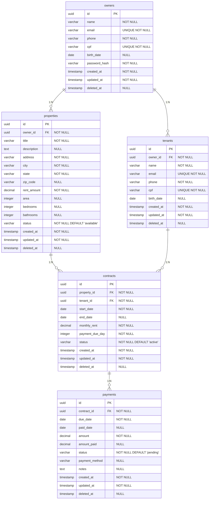

# 🗄️ Banco de Dados - Sistema Aluguei

## Visão Geral

O sistema utiliza **PostgreSQL 18** como banco de dados principal, com **GORM** como ORM para Go. A modelagem segue princípios de normalização e integridade referencial.

## Diagrama Entidade-Relacionamento



---

## DDL - Data Definition Language

### 1. Tabela: owners

```sql
CREATE TABLE owners (
    id UUID PRIMARY KEY DEFAULT gen_random_uuid(),
    name VARCHAR(255) NOT NULL,
    email VARCHAR(255) UNIQUE NOT NULL,
    phone VARCHAR(20) NOT NULL,
    cpf VARCHAR(14) UNIQUE NOT NULL,
    birth_date DATE,
    password_hash VARCHAR(255) NOT NULL,
    created_at TIMESTAMP WITH TIME ZONE NOT NULL DEFAULT NOW(),
    updated_at TIMESTAMP WITH TIME ZONE NOT NULL DEFAULT NOW(),
    deleted_at TIMESTAMP WITH TIME ZONE
);

-- Índices
CREATE INDEX idx_owners_email ON owners(email) WHERE deleted_at IS NULL;
CREATE INDEX idx_owners_cpf ON owners(cpf) WHERE deleted_at IS NULL;
CREATE INDEX idx_owners_deleted_at ON owners(deleted_at);

-- Triggers para updated_at
CREATE OR REPLACE FUNCTION update_updated_at_column()
RETURNS TRIGGER AS $$
BEGIN
    NEW.updated_at = NOW();
    RETURN NEW;
END;
$$ language 'plpgsql';

CREATE TRIGGER update_owners_updated_at 
    BEFORE UPDATE ON owners 
    FOR EACH ROW EXECUTE FUNCTION update_updated_at_column();
```

### 2. Tabela: properties

```sql
CREATE TABLE properties (
    id UUID PRIMARY KEY DEFAULT gen_random_uuid(),
    owner_id UUID NOT NULL REFERENCES owners(id) ON DELETE CASCADE,
    title VARCHAR(255) NOT NULL,
    description TEXT,
    address VARCHAR(500) NOT NULL,
    city VARCHAR(100) NOT NULL,
    state VARCHAR(2) NOT NULL,
    zip_code VARCHAR(10),
    rent_amount DECIMAL(10,2) NOT NULL CHECK (rent_amount > 0),
    area INTEGER CHECK (area > 0),
    bedrooms INTEGER CHECK (bedrooms >= 0),
    bathrooms INTEGER CHECK (bathrooms >= 0),
    status VARCHAR(20) NOT NULL DEFAULT 'available' 
        CHECK (status IN ('available', 'rented', 'maintenance', 'inactive')),
    created_at TIMESTAMP WITH TIME ZONE NOT NULL DEFAULT NOW(),
    updated_at TIMESTAMP WITH TIME ZONE NOT NULL DEFAULT NOW(),
    deleted_at TIMESTAMP WITH TIME ZONE
);

-- Índices
CREATE INDEX idx_properties_owner_id ON properties(owner_id) WHERE deleted_at IS NULL;
CREATE INDEX idx_properties_status ON properties(status) WHERE deleted_at IS NULL;
CREATE INDEX idx_properties_city_state ON properties(city, state) WHERE deleted_at IS NULL;
CREATE INDEX idx_properties_deleted_at ON properties(deleted_at);

-- Trigger para updated_at
CREATE TRIGGER update_properties_updated_at 
    BEFORE UPDATE ON properties 
    FOR EACH ROW EXECUTE FUNCTION update_updated_at_column();
```

### 3. Tabela: tenants

```sql
CREATE TABLE tenants (
    id UUID PRIMARY KEY DEFAULT gen_random_uuid(),
    owner_id UUID NOT NULL REFERENCES owners(id) ON DELETE CASCADE,
    name VARCHAR(255) NOT NULL,
    email VARCHAR(255) UNIQUE NOT NULL,
    phone VARCHAR(20) NOT NULL,
    cpf VARCHAR(14) UNIQUE NOT NULL,
    birth_date DATE,
    created_at TIMESTAMP WITH TIME ZONE NOT NULL DEFAULT NOW(),
    updated_at TIMESTAMP WITH TIME ZONE NOT NULL DEFAULT NOW(),
    deleted_at TIMESTAMP WITH TIME ZONE
);

-- Índices
CREATE INDEX idx_tenants_owner_id ON tenants(owner_id) WHERE deleted_at IS NULL;
CREATE INDEX idx_tenants_email ON tenants(email) WHERE deleted_at IS NULL;
CREATE INDEX idx_tenants_cpf ON tenants(cpf) WHERE deleted_at IS NULL;
CREATE INDEX idx_tenants_deleted_at ON tenants(deleted_at);

-- Trigger para updated_at
CREATE TRIGGER update_tenants_updated_at 
    BEFORE UPDATE ON tenants 
    FOR EACH ROW EXECUTE FUNCTION update_updated_at_column();
```

### 4. Tabela: contracts

```sql
CREATE TABLE contracts (
    id UUID PRIMARY KEY DEFAULT gen_random_uuid(),
    property_id UUID NOT NULL REFERENCES properties(id) ON DELETE CASCADE,
    tenant_id UUID NOT NULL REFERENCES tenants(id) ON DELETE CASCADE,
    start_date DATE NOT NULL,
    end_date DATE,
    monthly_rent DECIMAL(10,2) NOT NULL CHECK (monthly_rent > 0),
    payment_due_day INTEGER NOT NULL CHECK (payment_due_day BETWEEN 1 AND 28),
    status VARCHAR(20) NOT NULL DEFAULT 'active' 
        CHECK (status IN ('active', 'expired', 'cancelled', 'pending')),
    created_at TIMESTAMP WITH TIME ZONE NOT NULL DEFAULT NOW(),
    updated_at TIMESTAMP WITH TIME ZONE NOT NULL DEFAULT NOW(),
    deleted_at TIMESTAMP WITH TIME ZONE,
    
    -- Constraints
    CONSTRAINT chk_contract_dates CHECK (end_date IS NULL OR end_date > start_date)
);

-- Índices
CREATE INDEX idx_contracts_property_id ON contracts(property_id) WHERE deleted_at IS NULL;
CREATE INDEX idx_contracts_tenant_id ON contracts(tenant_id) WHERE deleted_at IS NULL;
CREATE INDEX idx_contracts_status ON contracts(status) WHERE deleted_at IS NULL;
CREATE INDEX idx_contracts_dates ON contracts(start_date, end_date) WHERE deleted_at IS NULL;
CREATE INDEX idx_contracts_deleted_at ON contracts(deleted_at);

-- Índice único para garantir apenas um contrato ativo por propriedade
CREATE UNIQUE INDEX idx_contracts_property_active 
    ON contracts(property_id) 
    WHERE status = 'active' AND deleted_at IS NULL;

-- Trigger para updated_at
CREATE TRIGGER update_contracts_updated_at 
    BEFORE UPDATE ON contracts 
    FOR EACH ROW EXECUTE FUNCTION update_updated_at_column();
```

### 5. Tabela: payments

```sql
CREATE TABLE payments (
    id UUID PRIMARY KEY DEFAULT gen_random_uuid(),
    contract_id UUID NOT NULL REFERENCES contracts(id) ON DELETE CASCADE,
    due_date DATE NOT NULL,
    paid_date DATE,
    amount DECIMAL(10,2) NOT NULL CHECK (amount > 0),
    amount_paid DECIMAL(10,2) CHECK (amount_paid >= 0),
    status VARCHAR(20) NOT NULL DEFAULT 'pending' 
        CHECK (status IN ('pending', 'paid', 'overdue', 'partial')),
    payment_method VARCHAR(20) 
        CHECK (payment_method IN ('pix', 'bank_transfer', 'cash', 'check')),
    notes TEXT,
    created_at TIMESTAMP WITH TIME ZONE NOT NULL DEFAULT NOW(),
    updated_at TIMESTAMP WITH TIME ZONE NOT NULL DEFAULT NOW(),
    deleted_at TIMESTAMP WITH TIME ZONE,
    
    -- Constraints
    CONSTRAINT chk_payment_amount_paid CHECK (amount_paid IS NULL OR amount_paid <= amount),
    CONSTRAINT chk_payment_paid_date CHECK (paid_date IS NULL OR status IN ('paid', 'partial'))
);

-- Índices
CREATE INDEX idx_payments_contract_id ON payments(contract_id) WHERE deleted_at IS NULL;
CREATE INDEX idx_payments_status ON payments(status) WHERE deleted_at IS NULL;
CREATE INDEX idx_payments_due_date ON payments(due_date) WHERE deleted_at IS NULL;
CREATE INDEX idx_payments_paid_date ON payments(paid_date) WHERE deleted_at IS NULL;
CREATE INDEX idx_payments_overdue ON payments(due_date) 
    WHERE status = 'pending' AND due_date < CURRENT_DATE AND deleted_at IS NULL;
CREATE INDEX idx_payments_deleted_at ON payments(deleted_at);

-- Trigger para updated_at
CREATE TRIGGER update_payments_updated_at 
    BEFORE UPDATE ON payments 
    FOR EACH ROW EXECUTE FUNCTION update_updated_at_column();
```

---

## Triggers e Funções Especiais

### 1. Atualização Automática de Status de Propriedade

```sql
-- Função para atualizar status da propriedade baseado em contratos
CREATE OR REPLACE FUNCTION update_property_status()
RETURNS TRIGGER AS $$
BEGIN
    -- Se contrato foi ativado, marcar propriedade como alugada
    IF NEW.status = 'active' AND (OLD.status IS NULL OR OLD.status != 'active') THEN
        UPDATE properties 
        SET status = 'rented' 
        WHERE id = NEW.property_id;
    END IF;
    
    -- Se contrato foi cancelado/expirado, verificar se propriedade deve ficar disponível
    IF OLD.status = 'active' AND NEW.status IN ('cancelled', 'expired') THEN
        -- Verificar se não há outros contratos ativos para a propriedade
        IF NOT EXISTS (
            SELECT 1 FROM contracts 
            WHERE property_id = NEW.property_id 
            AND status = 'active' 
            AND id != NEW.id
            AND deleted_at IS NULL
        ) THEN
            UPDATE properties 
            SET status = 'available' 
            WHERE id = NEW.property_id;
        END IF;
    END IF;
    
    RETURN NEW;
END;
$$ LANGUAGE plpgsql;

-- Trigger para atualizar status da propriedade
CREATE TRIGGER trigger_update_property_status
    AFTER UPDATE ON contracts
    FOR EACH ROW
    EXECUTE FUNCTION update_property_status();
```

### 2. Atualização Automática de Status de Pagamento

```sql
-- Função para atualizar status de pagamentos em atraso
CREATE OR REPLACE FUNCTION update_overdue_payments()
RETURNS void AS $$
BEGIN
    UPDATE payments 
    SET status = 'overdue'
    WHERE status = 'pending' 
    AND due_date < CURRENT_DATE
    AND deleted_at IS NULL;
END;
$$ LANGUAGE plpgsql;

-- Criar job para executar diariamente (requer extensão pg_cron)
-- SELECT cron.schedule('update-overdue-payments', '0 1 * * *', 'SELECT update_overdue_payments();');
```

---

## Views Úteis

### 1. View: Propriedades com Informações do Proprietário

```sql
CREATE VIEW v_properties_with_owner AS
SELECT 
    p.id,
    p.title,
    p.address,
    p.city,
    p.state,
    p.rent_amount,
    p.status,
    p.created_at,
    o.name as owner_name,
    o.email as owner_email,
    o.phone as owner_phone
FROM properties p
JOIN owners o ON p.owner_id = o.id
WHERE p.deleted_at IS NULL AND o.deleted_at IS NULL;
```

### 2. View: Contratos Ativos com Detalhes

```sql
CREATE VIEW v_active_contracts AS
SELECT 
    c.id,
    c.start_date,
    c.end_date,
    c.monthly_rent,
    c.payment_due_day,
    p.title as property_title,
    p.address as property_address,
    t.name as tenant_name,
    t.email as tenant_email,
    t.phone as tenant_phone,
    o.name as owner_name
FROM contracts c
JOIN properties p ON c.property_id = p.id
JOIN tenants t ON c.tenant_id = t.id
JOIN owners o ON p.owner_id = o.id
WHERE c.status = 'active' 
AND c.deleted_at IS NULL 
AND p.deleted_at IS NULL 
AND t.deleted_at IS NULL 
AND o.deleted_at IS NULL;
```

### 3. View: Pagamentos em Atraso

```sql
CREATE VIEW v_overdue_payments AS
SELECT 
    pay.id,
    pay.due_date,
    pay.amount,
    pay.created_at,
    CURRENT_DATE - pay.due_date as days_overdue,
    c.monthly_rent,
    p.title as property_title,
    p.address as property_address,
    t.name as tenant_name,
    t.email as tenant_email,
    t.phone as tenant_phone,
    o.name as owner_name,
    o.email as owner_email
FROM payments pay
JOIN contracts c ON pay.contract_id = c.id
JOIN properties p ON c.property_id = p.id
JOIN tenants t ON c.tenant_id = t.id
JOIN owners o ON p.owner_id = o.id
WHERE pay.status = 'overdue'
AND pay.deleted_at IS NULL
ORDER BY pay.due_date ASC;
```

---

## Índices de Performance

### Índices Compostos para Queries Frequentes

```sql
-- Busca de propriedades por proprietário e status
CREATE INDEX idx_properties_owner_status ON properties(owner_id, status) 
WHERE deleted_at IS NULL;

-- Busca de contratos por propriedade e status
CREATE INDEX idx_contracts_property_status ON contracts(property_id, status) 
WHERE deleted_at IS NULL;

-- Busca de pagamentos por contrato e status
CREATE INDEX idx_payments_contract_status ON payments(contract_id, status) 
WHERE deleted_at IS NULL;

-- Busca de pagamentos por período
CREATE INDEX idx_payments_date_range ON payments(due_date, paid_date) 
WHERE deleted_at IS NULL;
```

---

## Configurações de Performance

### Configurações PostgreSQL Recomendadas

```sql
-- Configurações para desenvolvimento
ALTER SYSTEM SET shared_buffers = '256MB';
ALTER SYSTEM SET effective_cache_size = '1GB';
ALTER SYSTEM SET maintenance_work_mem = '64MB';
ALTER SYSTEM SET checkpoint_completion_target = 0.9;
ALTER SYSTEM SET wal_buffers = '16MB';
ALTER SYSTEM SET default_statistics_target = 100;
ALTER SYSTEM SET random_page_cost = 1.1;
ALTER SYSTEM SET effective_io_concurrency = 200;

-- Recarregar configurações
SELECT pg_reload_conf();
```

---

## Backup e Manutenção

### Script de Backup

```bash
#!/bin/bash
# backup_aluguei.sh

DB_NAME="aluguei"
DB_USER="postgres"
BACKUP_DIR="/backups"
DATE=$(date +%Y%m%d_%H%M%S)

# Backup completo
pg_dump -U $DB_USER -h localhost -d $DB_NAME \
    --format=custom \
    --compress=9 \
    --file="$BACKUP_DIR/aluguei_backup_$DATE.dump"

# Backup apenas dados (para seeds)
pg_dump -U $DB_USER -h localhost -d $DB_NAME \
    --data-only \
    --format=custom \
    --file="$BACKUP_DIR/aluguei_data_$DATE.dump"

# Manter apenas últimos 7 backups
find $BACKUP_DIR -name "aluguei_backup_*.dump" -mtime +7 -delete
```

### Manutenção Automática

```sql
-- Análise de estatísticas (executar semanalmente)
ANALYZE;

-- Reindexação (executar mensalmente)
REINDEX DATABASE aluguei;

-- Limpeza de registros antigos (soft delete > 1 ano)
DELETE FROM owners WHERE deleted_at < NOW() - INTERVAL '1 year';
DELETE FROM properties WHERE deleted_at < NOW() - INTERVAL '1 year';
DELETE FROM tenants WHERE deleted_at < NOW() - INTERVAL '1 year';
DELETE FROM contracts WHERE deleted_at < NOW() - INTERVAL '1 year';
DELETE FROM payments WHERE deleted_at < NOW() - INTERVAL '1 year';
```

---

## Migrations com GORM

### Estrutura de Migration

```go
// internal/infrastructure/database/migrations.go
func AutoMigrate(db *gorm.DB) error {
    return db.AutoMigrate(
        &entities.Owner{},
        &entities.Property{},
        &entities.Tenant{},
        &entities.Contract{},
        &entities.Payment{},
    )
}
```

### Seeds de Desenvolvimento

```go
// internal/infrastructure/seeds/seeder.go
func SeedDatabase(db *gorm.DB) error {
    // Implementação do seeder com dados de teste
    // Ver arquivo seeds/seeder.go para implementação completa
}
```

Esta estrutura de banco de dados garante integridade, performance e escalabilidade para o sistema Aluguei, suportando todas as funcionalidades do MVP 1 e preparando para expansões futuras.