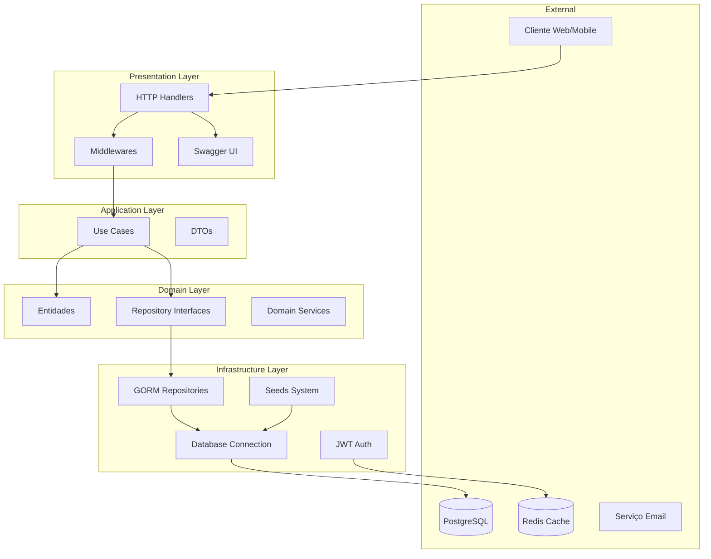
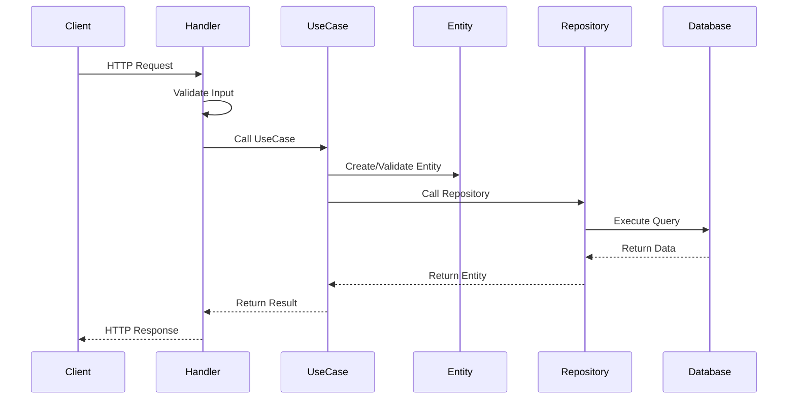
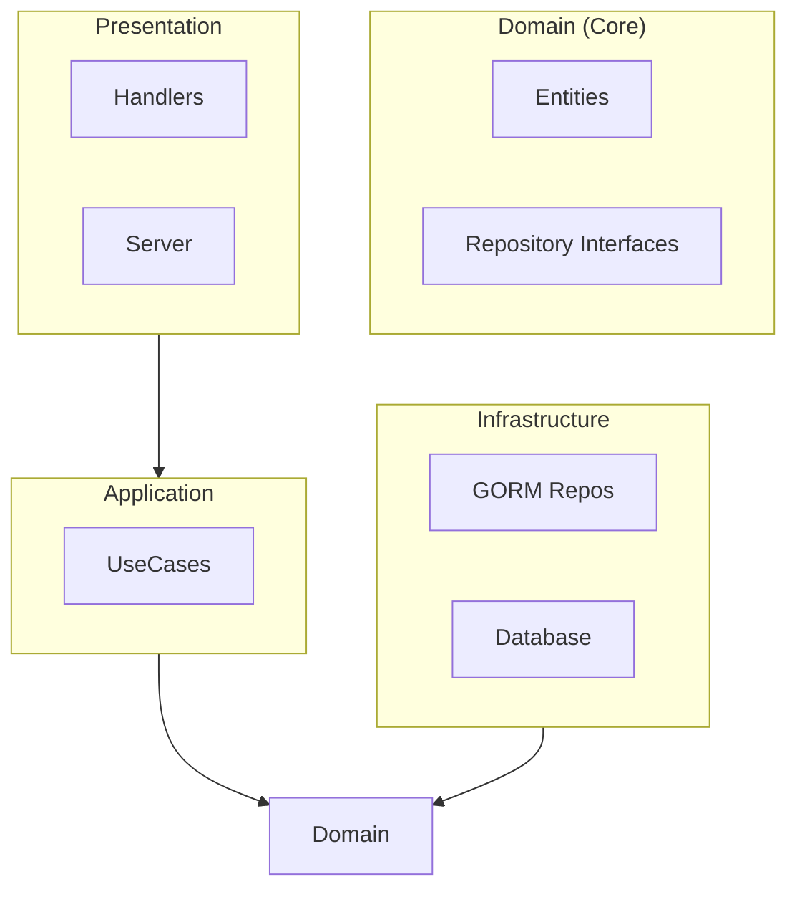

# 🏗️ Arquitetura do Sistema Aluguei

## Visão Geral

O sistema Aluguei segue os princípios de **Clean Architecture** combinados com **Domain-Driven Design (DDD)**, garantindo separação de responsabilidades, testabilidade e manutenibilidade.

## Diagrama de Arquitetura



---

## Camadas da Arquitetura

### 1. Domain Layer (Núcleo)

**Localização**: `internal/domain/`

A camada mais interna, contém a lógica de negócio pura, independente de frameworks e tecnologias externas.

#### Entidades (`entities/`)
```go
// internal/domain/entities/owner.go
type Owner struct {
    ID        uuid.UUID  `json:"id" gorm:"type:uuid;primary_key;default:gen_random_uuid()"`
    Name      string     `json:"name" gorm:"not null"`
    Email     string     `json:"email" gorm:"uniqueIndex;not null"`
    // ... outros campos
}

func (o *Owner) ValidateForCreation() error {
    // Regras de negócio para criação
}
```

#### Repository Interfaces (`repositories/`)
```go
// internal/domain/repositories/owner_repository.go
type OwnerRepository interface {
    Create(ctx context.Context, owner *entities.Owner) error
    GetByID(ctx context.Context, id uuid.UUID) (*entities.Owner, error)
    GetByEmail(ctx context.Context, email string) (*entities.Owner, error)
    // ... outros métodos
}
```

#### Características:
- **Independente** de frameworks e bibliotecas externas
- **Contém** regras de negócio e validações
- **Define** interfaces para repositórios
- **Não depende** de outras camadas

---

### 2. Application Layer (Casos de Uso)

**Localização**: `internal/application/`

Orquestra a lógica de negócio, coordenando entidades e repositórios para implementar casos de uso específicos.

#### Use Cases (`usecases/`)
```go
// internal/application/usecases/owner_usecase.go
type OwnerUseCase struct {
    ownerRepo repositories.OwnerRepository
}

func (uc *OwnerUseCase) CreateOwner(ctx context.Context, req CreateOwnerRequest) (*entities.Owner, error) {
    // 1. Validar dados de entrada
    // 2. Verificar regras de negócio
    // 3. Criar entidade
    // 4. Persistir via repositório
    // 5. Retornar resultado
}
```

#### Características:
- **Orquestra** a lógica de aplicação
- **Usa** interfaces de repositório (não implementações)
- **Implementa** casos de uso específicos
- **Independente** de detalhes de infraestrutura

---

### 3. Infrastructure Layer (Implementações)

**Localização**: `internal/infrastructure/`

Implementa as interfaces definidas no domínio, lidando com detalhes técnicos como banco de dados, cache, etc.

#### Database (`database/`)
```go
// internal/infrastructure/database/database.go
func NewPostgreSQLConnection(config Config) (*gorm.DB, error) {
    dsn := fmt.Sprintf("host=%s user=%s password=%s dbname=%s port=%s sslmode=disable",
        config.Host, config.User, config.Password, config.DBName, config.Port)
    
    return gorm.Open(postgres.Open(dsn), &gorm.Config{
        Logger: logger.Default.LogMode(logger.Info),
    })
}
```

#### Persistence (`persistence/`)
```go
// internal/infrastructure/persistence/owner_repository.go
type ownerRepository struct {
    db *gorm.DB
}

func (r *ownerRepository) Create(ctx context.Context, owner *entities.Owner) error {
    return r.db.WithContext(ctx).Create(owner).Error
}
```

#### Seeds (`seeds/`)
```go
// internal/infrastructure/seeds/seeder.go
func SeedDatabase(db *gorm.DB) error {
    // Criar dados de exemplo para desenvolvimento
}
```

#### Características:
- **Implementa** interfaces do domínio
- **Lida** com detalhes técnicos (SQL, HTTP, etc.)
- **Pode** usar frameworks e bibliotecas externas
- **Depende** apenas do domínio

---

### 4. Presentation Layer (Interface)

**Localização**: `internal/presentation/`

Expõe a aplicação para o mundo externo através de APIs REST, lidando com protocolos de comunicação.

#### Handlers (`handlers/`)
```go
// internal/presentation/handlers/owner_handler.go
type OwnerHandler struct {
    ownerUseCase *usecases.OwnerUseCase
}

func (h *OwnerHandler) CreateOwner(c *gin.Context) {
    var req CreateOwnerRequest
    if err := c.ShouldBindJSON(&req); err != nil {
        c.JSON(400, gin.H{"error": err.Error()})
        return
    }
    
    owner, err := h.ownerUseCase.CreateOwner(c.Request.Context(), req)
    if err != nil {
        c.JSON(500, gin.H{"error": err.Error()})
        return
    }
    
    c.JSON(201, owner)
}
```

#### Server (`server/`)
```go
// internal/presentation/server/server.go
func NewServer(useCases *UseCases) *gin.Engine {
    r := gin.Default()
    
    // Middlewares
    r.Use(cors.Default())
    r.Use(middleware.Logger())
    
    // Routes
    api := r.Group("/api/v1")
    setupOwnerRoutes(api, useCases.Owner)
    
    return r
}
```

#### Características:
- **Expõe** a aplicação via HTTP
- **Converte** entre formatos (JSON, XML, etc.)
- **Lida** com autenticação e autorização
- **Depende** da camada de aplicação

---

## Fluxo de Dados

### Request Flow (Entrada)


### Dependency Flow (Dependências)


---

## Padrões Implementados

### 1. Repository Pattern
```go
// Interface no domínio
type OwnerRepository interface {
    Create(ctx context.Context, owner *entities.Owner) error
    GetByID(ctx context.Context, id uuid.UUID) (*entities.Owner, error)
}

// Implementação na infraestrutura
type ownerRepository struct {
    db *gorm.DB
}
```

### 2. Dependency Injection
```go
// Injeção de dependências via construtor
func NewOwnerUseCase(ownerRepo repositories.OwnerRepository) *OwnerUseCase {
    return &OwnerUseCase{
        ownerRepo: ownerRepo,
    }
}
```

### 3. Use Case Pattern
```go
// Cada operação é um caso de uso específico
func (uc *OwnerUseCase) CreateOwner(ctx context.Context, req CreateOwnerRequest) (*entities.Owner, error)
func (uc *OwnerUseCase) GetOwnerByID(ctx context.Context, id uuid.UUID) (*entities.Owner, error)
```

### 4. Factory Pattern
```go
// Factory para criar instâncias configuradas
func NewUseCases(repos *Repositories) *UseCases {
    return &UseCases{
        Owner:    NewOwnerUseCase(repos.Owner),
        Property: NewPropertyUseCase(repos.Property),
        // ...
    }
}
```

---

## Estrutura de Diretórios

```
src/Backend/
├── cmd/                          # Aplicações executáveis
│   ├── api/main.go              # Aplicação principal da API
│   └── seed/main.go             # Seeder de dados
├── internal/                     # Código interno da aplicação
│   ├── domain/                  # Camada de domínio (núcleo)
│   │   ├── entities/            # Entidades de negócio
│   │   │   ├── owner.go
│   │   │   ├── property.go
│   │   │   ├── tenant.go
│   │   │   ├── contract.go
│   │   │   └── payment.go
│   │   └── repositories/        # Interfaces de repositório
│   │       ├── owner_repository.go
│   │       ├── property_repository.go
│   │       ├── tenant_repository.go
│   │       ├── contract_repository.go
│   │       └── payment_repository.go
│   ├── application/             # Camada de aplicação
│   │   └── usecases/            # Casos de uso
│   │       ├── owner_usecase.go
│   │       ├── property_usecase.go
│   │       ├── tenant_usecase.go
│   │       ├── contract_usecase.go
│   │       └── payment_usecase.go
│   ├── infrastructure/          # Camada de infraestrutura
│   │   ├── database/            # Configuração do banco
│   │   │   └── database.go
│   │   ├── persistence/         # Implementações de repositório
│   │   │   ├── owner_repository.go
│   │   │   ├── property_repository.go
│   │   │   ├── tenant_repository.go
│   │   │   ├── contract_repository.go
│   │   │   └── payment_repository.go
│   │   └── seeds/               # Sistema de seeds
│   │       ├── seeder.go
│   │       └── README.md
│   └── presentation/            # Camada de apresentação
│       ├── handlers/            # Handlers HTTP
│       │   ├── auth_handler.go
│       │   ├── owner_handler.go
│       │   ├── property_handler.go
│       │   ├── tenant_handler.go
│       │   ├── contract_handler.go
│       │   ├── payment_handler.go
│       │   ├── health_handler.go
│       │   └── swagger_handler.go
│       └── server/              # Configuração do servidor
│           └── server.go
├── test/                        # Testes
│   ├── integration/             # Testes de integração
│   ├── benchmark/               # Testes de performance
│   └── testhelpers/             # Utilitários de teste
├── docs/                        # Documentação
│   └── swagger.yaml             # Especificação da API
├── docker-compose.yml           # Ambiente de desenvolvimento
├── Makefile                     # Comandos de desenvolvimento
├── go.mod                       # Dependências Go
└── README.md                    # Documentação do projeto
```

---

## Configuração e Inicialização

### 1. Inicialização da Aplicação
```go
// cmd/api/main.go
func main() {
    // 1. Carregar configurações
    config := loadConfig()
    
    // 2. Conectar ao banco de dados
    db, err := database.NewPostgreSQLConnection(config.Database)
    if err != nil {
        log.Fatal("Failed to connect to database:", err)
    }
    
    // 3. Executar migrations
    if err := db.AutoMigrate(&entities.Owner{}, /* ... */); err != nil {
        log.Fatal("Failed to migrate database:", err)
    }
    
    // 4. Criar repositórios
    repos := &Repositories{
        Owner:    persistence.NewOwnerRepository(db),
        Property: persistence.NewPropertyRepository(db),
        // ...
    }
    
    // 5. Criar casos de uso
    useCases := NewUseCases(repos)
    
    // 6. Criar servidor HTTP
    server := server.NewServer(useCases)
    
    // 7. Iniciar servidor
    log.Fatal(server.Run(":8080"))
}
```

### 2. Configuração de Dependências
```go
// Estrutura para organizar dependências
type Repositories struct {
    Owner    repositories.OwnerRepository
    Property repositories.PropertyRepository
    Tenant   repositories.TenantRepository
    Contract repositories.ContractRepository
    Payment  repositories.PaymentRepository
}

type UseCases struct {
    Owner    *usecases.OwnerUseCase
    Property *usecases.PropertyUseCase
    Tenant   *usecases.TenantUseCase
    Contract *usecases.ContractUseCase
    Payment  *usecases.PaymentUseCase
}
```

---

## Benefícios da Arquitetura

### 1. Testabilidade
- **Isolamento**: Cada camada pode ser testada independentemente
- **Mocking**: Interfaces permitem fácil criação de mocks
- **Cobertura**: Testes unitários, integração e end-to-end

### 2. Manutenibilidade
- **Separação**: Responsabilidades bem definidas
- **Baixo Acoplamento**: Mudanças em uma camada não afetam outras
- **Alta Coesão**: Código relacionado fica junto

### 3. Escalabilidade
- **Modular**: Fácil adicionar novas funcionalidades
- **Flexível**: Pode trocar implementações sem afetar o core
- **Extensível**: Suporta crescimento do sistema

### 4. Independência
- **Framework**: Não depende de frameworks específicos
- **Database**: Pode trocar banco de dados facilmente
- **UI**: Pode ter múltiplas interfaces (web, mobile, CLI)

---

## Próximos Passos

### MVP 2 - Melhorias Arquiteturais
- **CQRS**: Separar commands e queries
- **Event Sourcing**: Para auditoria avançada
- **Cache Layer**: Redis para performance
- **Message Queue**: Para processamento assíncrono

### MVP 3 - Microserviços
- **Service Decomposition**: Separar em serviços menores
- **API Gateway**: Centralizar roteamento
- **Service Discovery**: Para comunicação entre serviços
- **Distributed Tracing**: Para observabilidade

Esta arquitetura fornece uma base sólida e escalável para o sistema Aluguei, permitindo evolução incremental e manutenção eficiente.