# 🔄 Fluxos do Sistema Aluguei

## Visão Geral

Este documento apresenta os principais fluxos de negócio do sistema Aluguei, desde o cadastro inicial até a gestão completa de aluguéis.

---

## 1. Fluxo de Cadastro e Autenticação

### 1.1 Cadastro de Proprietário

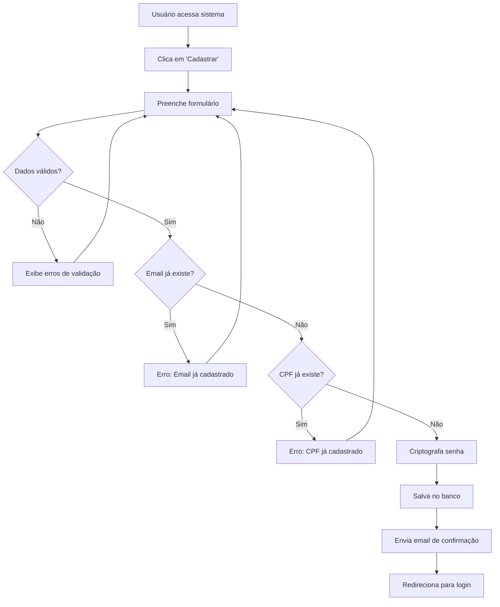

### 1.2 Login de Usuário

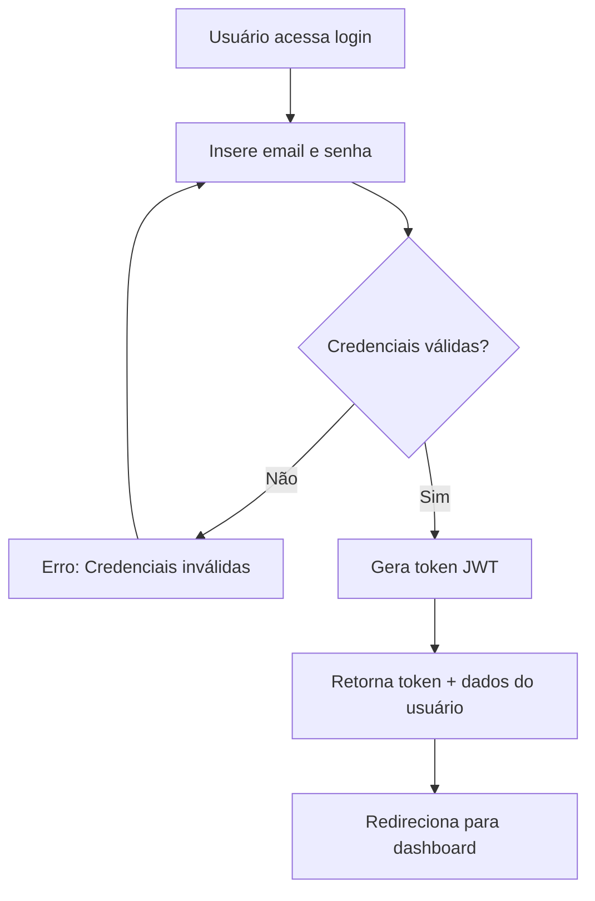

---

## 2. Fluxo de Gestão de Propriedades

### 2.1 Cadastro de Propriedade

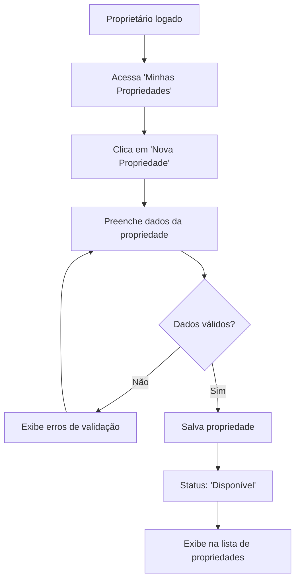

### 2.2 Alteração de Status da Propriedade

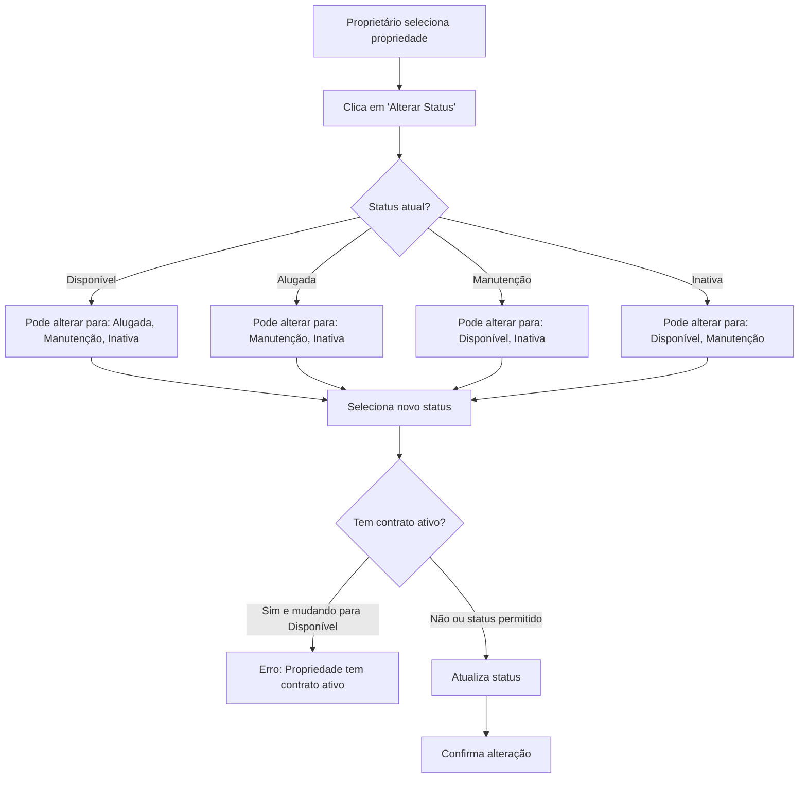

---

## 3. Fluxo de Gestão de Inquilinos

### 3.1 Cadastro de Inquilino

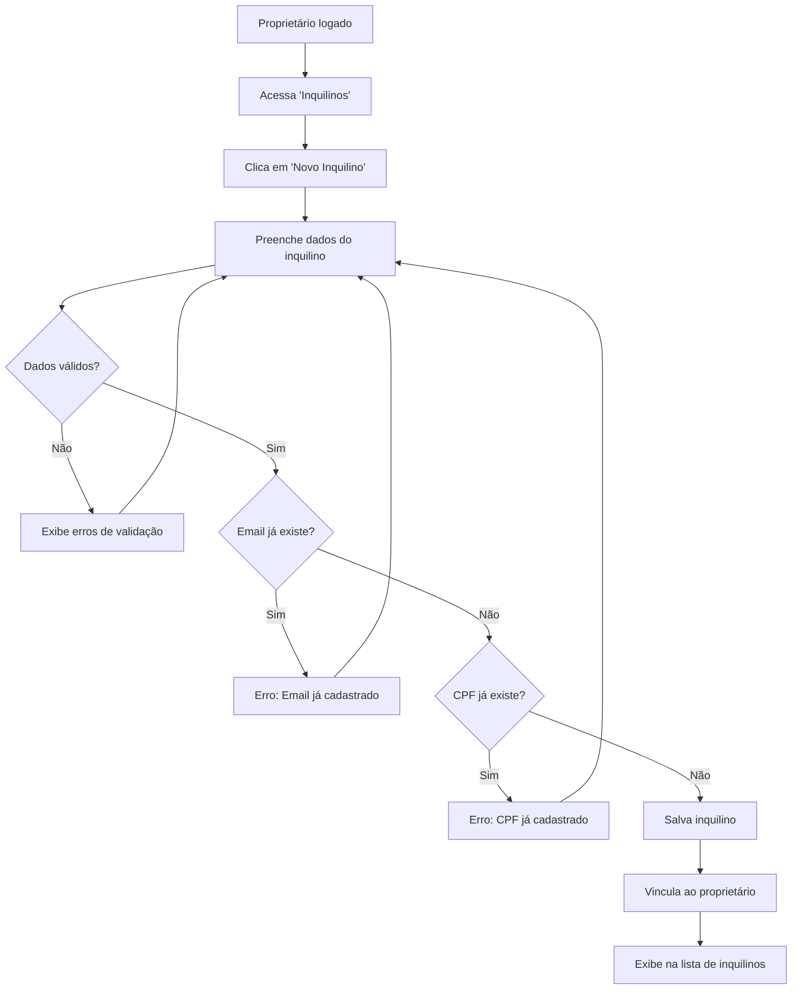

---

## 4. Fluxo de Criação de Contrato

### 4.1 Novo Contrato de Aluguel

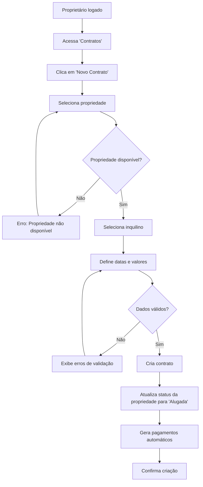

### 4.2 Geração Automática de Pagamentos

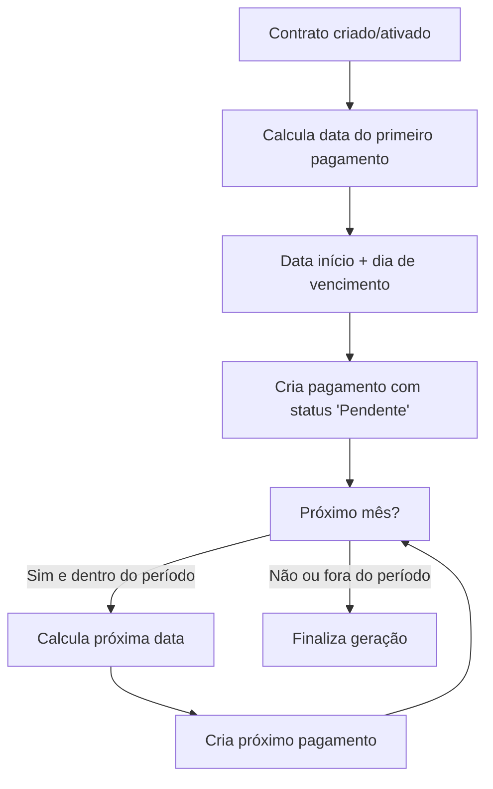

---

## 5. Fluxo de Gestão de Pagamentos

### 5.1 Registro de Pagamento

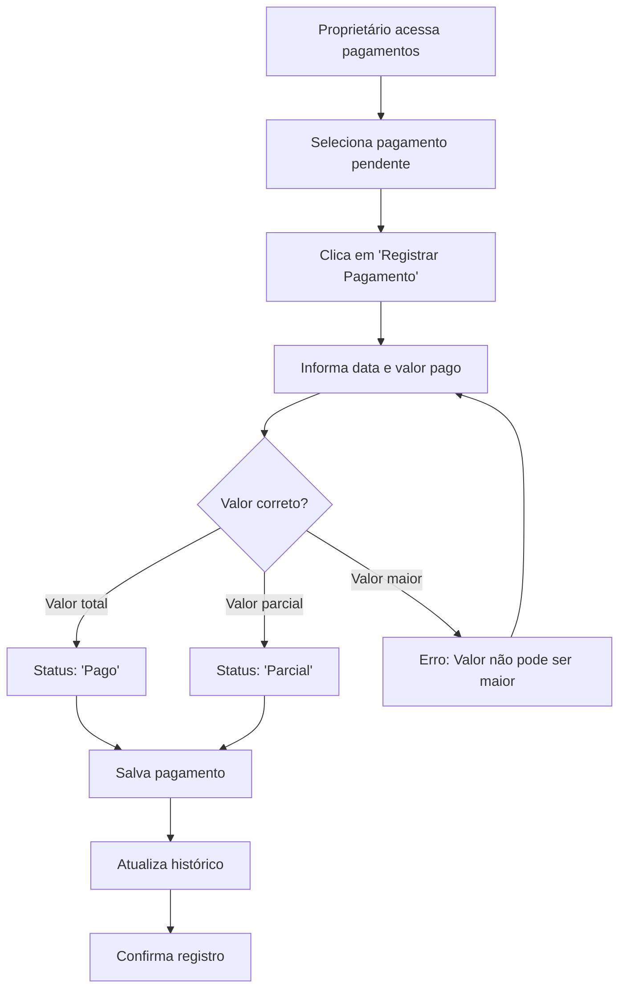

### 5.2 Identificação de Atrasos (Processo Automático)

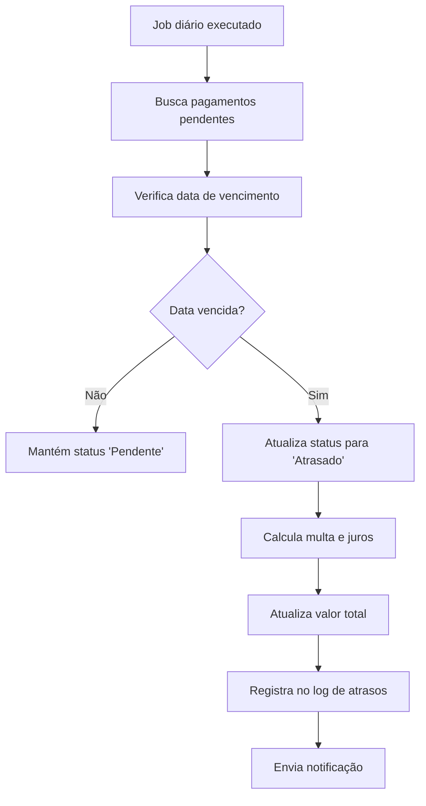

---

## 6. Fluxo de Cancelamento de Contrato

### 6.1 Encerramento de Locação

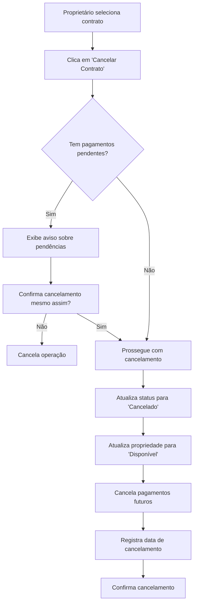

---

## 7. Fluxos de Consulta e Relatórios

### 7.1 Dashboard do Proprietário

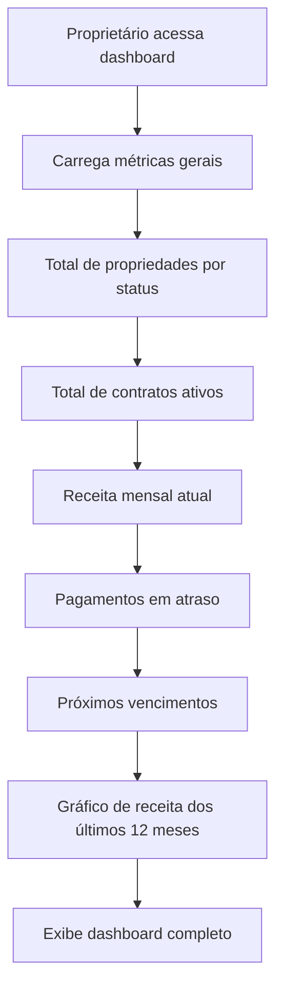

### 7.2 Relatório de Inadimplência

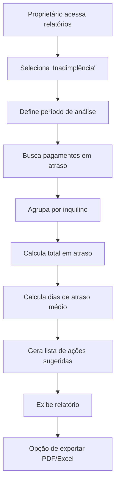

---

## 8. Fluxos de Validação e Segurança

### 8.1 Middleware de Autenticação

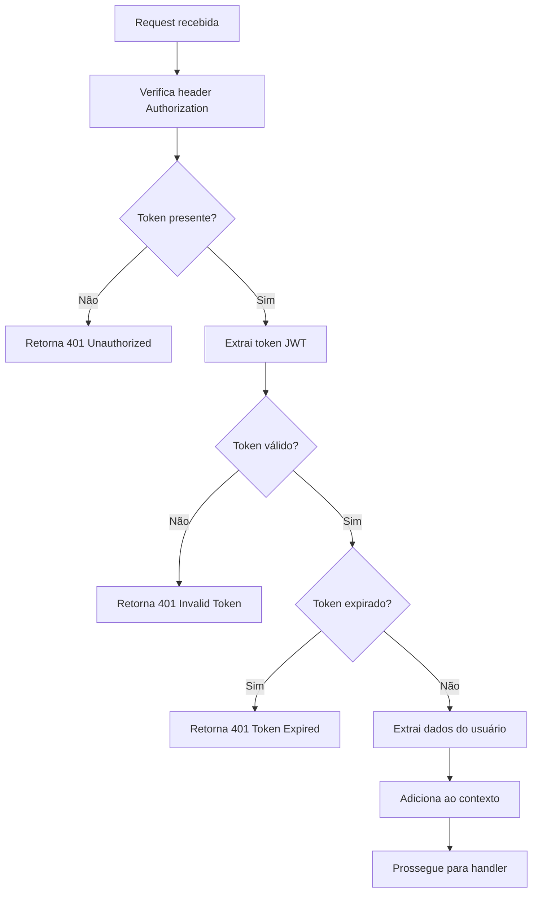

### 8.2 Validação de Dados de Entrada

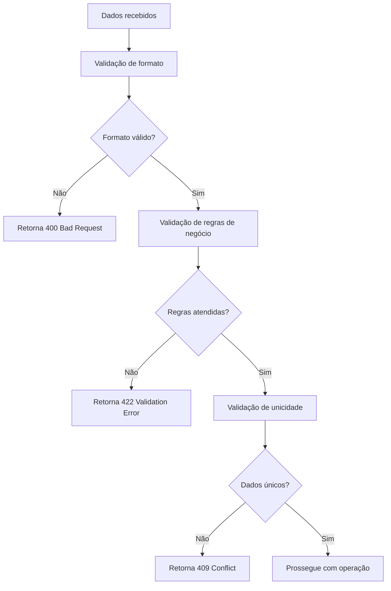

---

## 9. Fluxos de Integração (MVP 2/3)

### 9.1 Notificação por Email (Planejado)

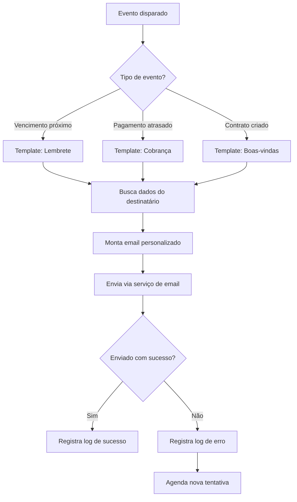

### 9.2 Pagamento via PIX (Planejado)

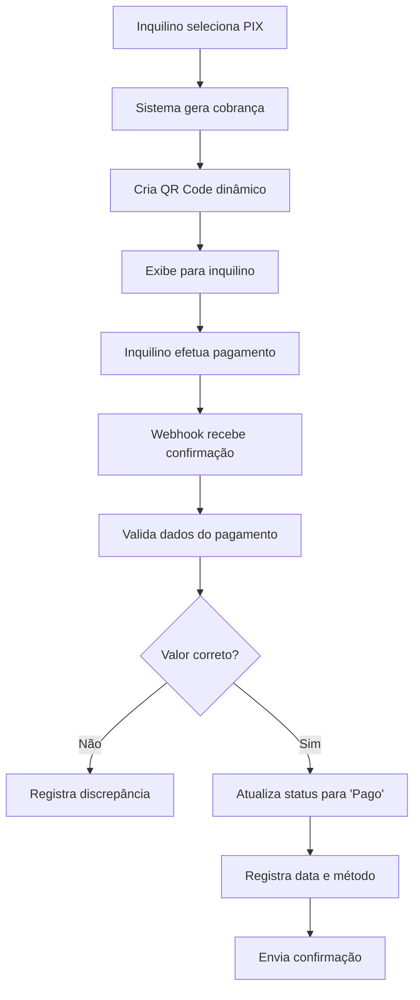

---

## 10. Fluxos de Manutenção e Monitoramento

### 10.1 Health Check

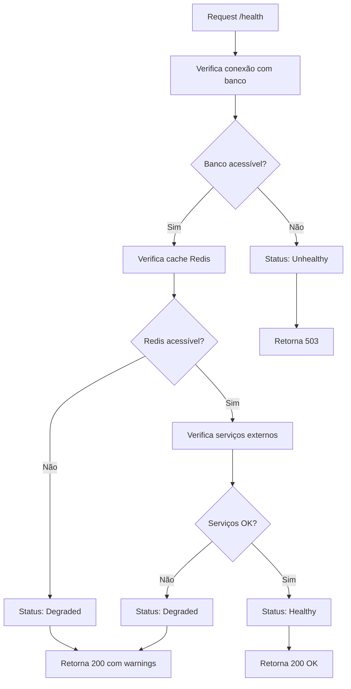

### 10.2 Backup Automático

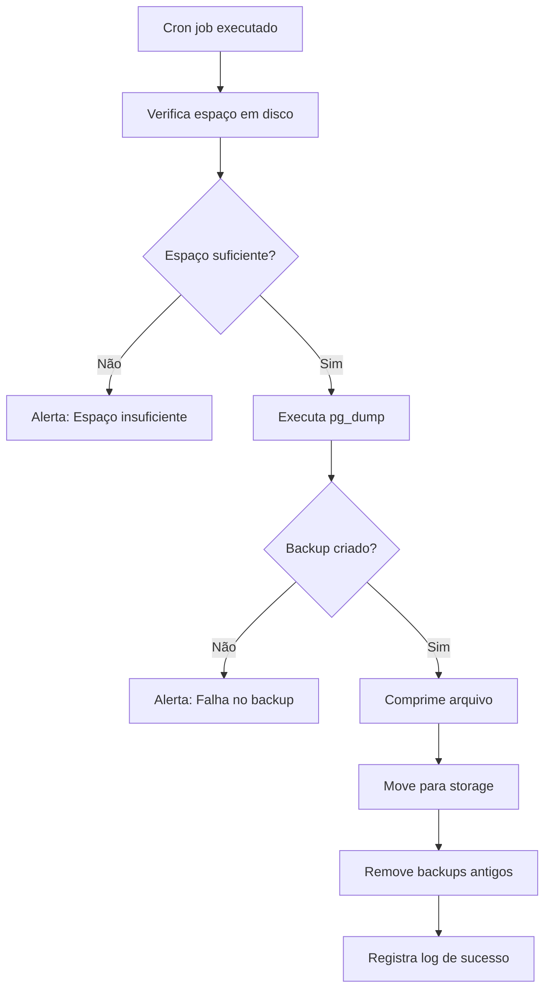

Estes fluxos garantem que todas as operações do sistema sejam executadas de forma consistente e segura, proporcionando uma experiência confiável para proprietários e inquilinos.