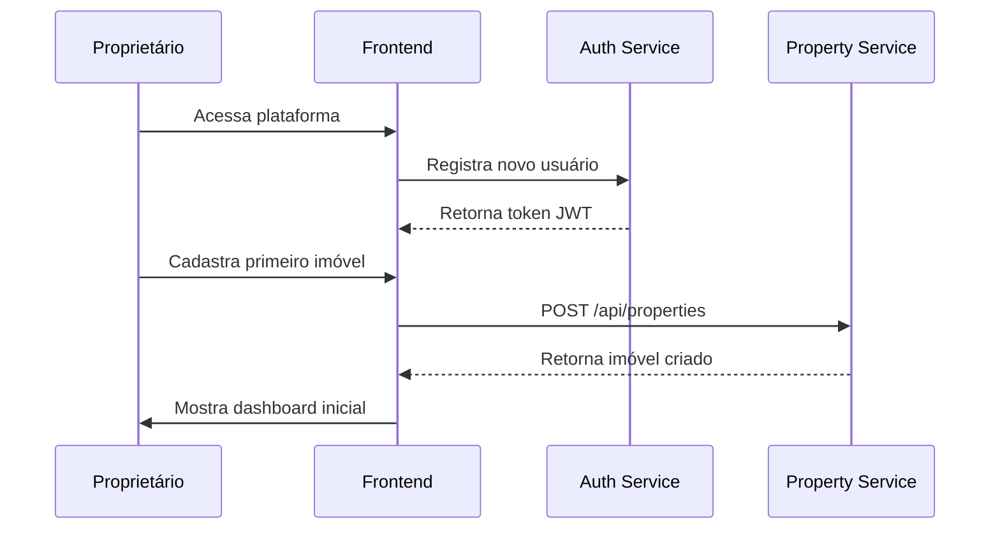
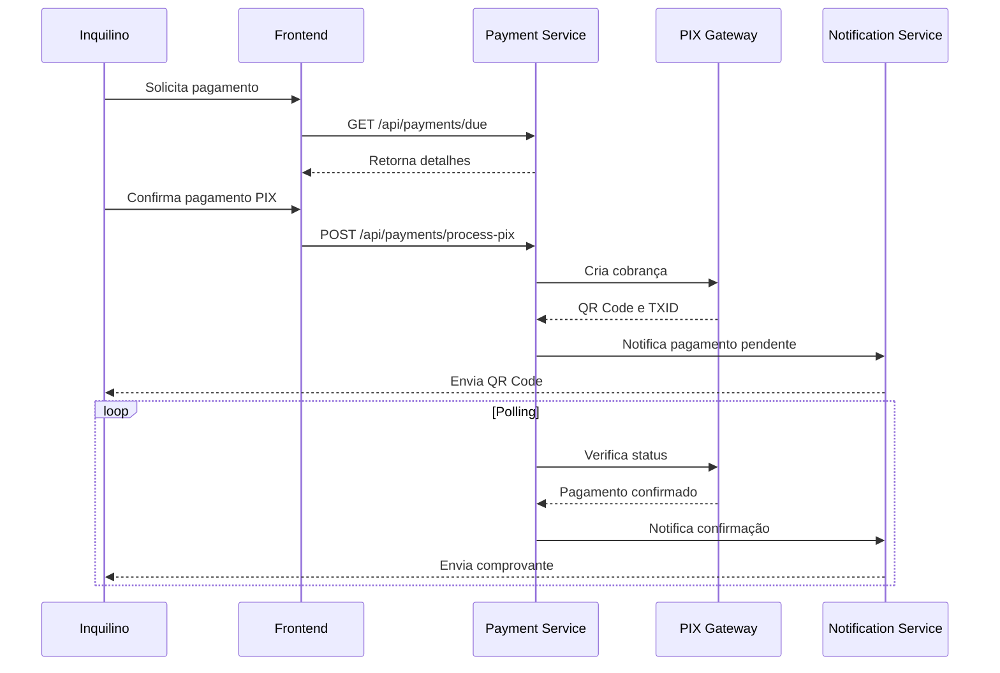

## 🔄 **FLUXOS PRINCIPAIS**

### **Fluxo 1: Onboarding do Proprietário**

```mermaid
sequenceDiagram
    participant P as Proprietário
    participant F as Frontend
    participant A as Auth Service
    participant PS as Property Service

    P->>F: Acessa plataforma
    F->>A: Registra novo usuário
    A-->>F: Retorna token JWT
    P->>F: Cadastra primeiro imóvel
    F->>PS: POST /api/properties
    PS-->>F: Retorna imóvel criado
    F->>P: Mostra dashboard inicial
```

### **Fluxo 2: Processo de Pagamento**

```mermaid
sequenceDiagram
    participant T as Inquilino
    participant F as Frontend
    participant PS as Payment Service
    participant PG as PIX Gateway
    participant NS as Notification Service

    T->>F: Solicita pagamento
    F->>PS: GET /api/payments/due
    PS-->>F: Retorna detalhes
    T->>F: Confirma pagamento PIX
    F->>PS: POST /api/payments/process-pix
    PS->>PG: Cria cobrança
    PG-->>PS: QR Code e TXID
    PS->>NS: Notifica pagamento pendente
    NS-->>T: Envia QR Code
    
    loop Polling
        PS->>PG: Verifica status
        PG-->>PS: Pagamento confirmado
        PS->>NS: Notifica confirmação
        NS-->>T: Envia comprovante
    end
```